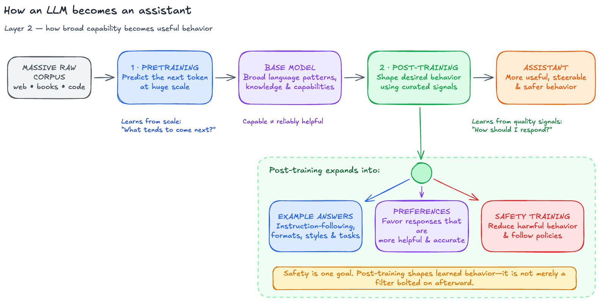
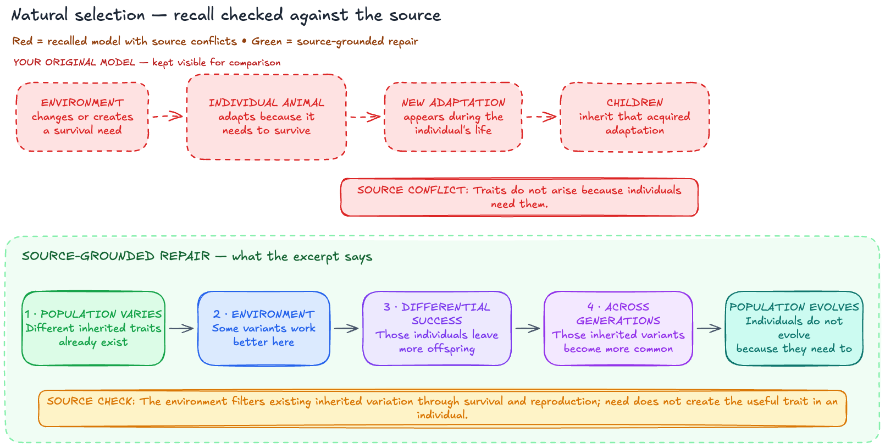
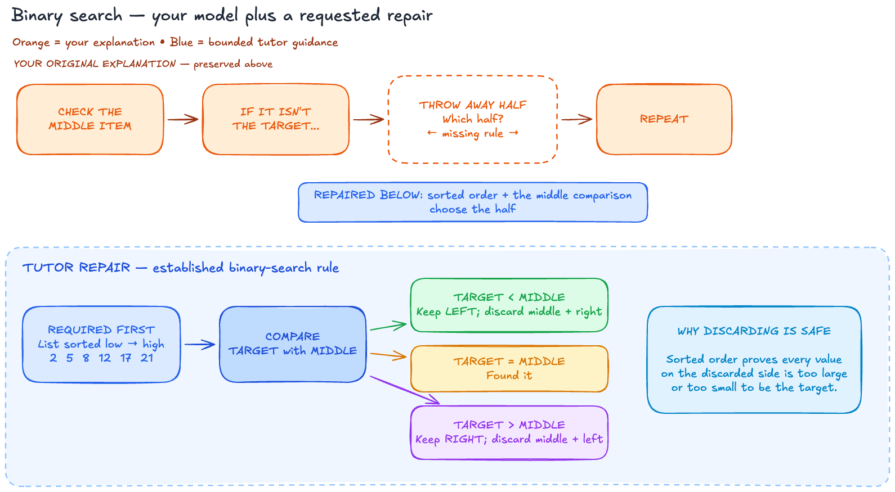

<p align="center">
  
</p>

# Deep Study

Research-backed AI tutoring, study companionship, and teach-back—packaged for ChatGPT and Codex.

Deep Study gives you three distinct learning relationships:

| Relationship | Use it when | What the AI does |
| --- | --- | --- |
| **Guided Tutor** | You want to learn something new | Teaches in short adaptive cycles, then fades support and checks retrieval |
| **Study Companion** | You are learning from a book, paper, lecture, or course | Stays out of the way, answers questions, and checks what stuck when you return |
| **Teach-Back Student** | You want to learn by explaining | Acts like a genuinely curious student, asks authentic questions, and tries to use what you taught |

The relationships can change naturally during one conversation. You do not need mode commands: start explaining and the tutor can become the student; ask for a missing foundation and the student can briefly teach; return to your source and the tutor can step back.

## What makes it different

- **Active, not performative:** explanations lead to prediction, application, retrieval, or teaching.
- **Bounded help when stuck:** first “I don’t know” gets one useful hint; the second gets guided reasoning; asking to skip gets the answer.
- **Natural voice behavior:** short turns, one real question at a time, no protocol narration.
- **Optional live whiteboard:** all three relationships can build and revise an Excalidraw canvas while you talk.
- **Honest evidence boundary:** the component techniques are research-backed; the complete AI workflow is an evidence-informed design, not a clinically validated intervention.

## Install the complete plugin

Deep Study is currently distributed as a GitHub marketplace for Codex and the ChatGPT desktop app. In Codex CLI:

```bash
codex plugin marketplace add VihaanMotwani/deep-study-skills
codex plugin add deep-study@deep-study
```

Then start a new task so the three skills and the whiteboard server are loaded.

In the ChatGPT desktop app, open **Plugins**, choose the **Deep Study** marketplace, install **Deep Study**, and begin a new chat. Public ChatGPT directory installation will follow after the packaged release has been tested.

### Whiteboard requirement

Conversation-only learning works without extra setup. The live canvas requires:

- Node.js 18 or newer;
- `npx`;
- permission for first-run download of the pinned `mcp-excalidraw-server@1.1.0` package.

The skill asks before opening an elaborate visual unless you already requested one. If the server cannot start, the conversation continues with a static diagram or text.

## Install only one skill

Ask `$skill-installer` in Codex to install the skill you want from its GitHub path:

| Skill | Repository path |
| --- | --- |
| Guided Tutor | `plugins/deep-study/skills/guided-tutor` |
| Study Companion | `plugins/deep-study/skills/study-companion` |
| Teach-Back Student | `plugins/deep-study/skills/teach-back-student` |

Example:

```text
$skill-installer Install guided-tutor from
https://github.com/VihaanMotwani/deep-study-skills/tree/main/plugins/deep-study/skills/guided-tutor
```

For a manual Codex installation, copy the chosen skill directory into `$HOME/.agents/skills/`, then restart Codex if it does not appear.

## Try it

You can select a skill explicitly, or just describe the relationship you want:

```text
Teach me Bayes' theorem from scratch. I want to understand a medical-test example.
```

```text
I'm reading chapter four on my own. Stay here in case I get stuck; I'll come back when I'm finished.
```

```text
Let me teach you gradient descent. Be a curious student and stop me when you lose the thread.
```

For a live visual:

```text
Teach this on a live whiteboard and build the diagram as we go.
```

## Whiteboard examples

The canvas serves a different purpose in each relationship:

| Guided Tutor | Study Companion | Teach-Back Student |
| --- | --- | --- |
| Builds the expert model in stages | Makes the learner's recalled model inspectable before repair | Shows what the student could infer from the learner's explanation |
|  |  |  |

Editable `.excalidraw` versions live in [`examples/whiteboards`](examples/whiteboards).

## Research and evaluation

- [`RESEARCH.md`](RESEARCH.md) maps each behavior to its research basis and states what the evidence does **not** establish.
- Each skill also includes a focused `references/research.md`.
- [`EVALUATION.md`](EVALUATION.md) explains the current tests, results, limitations, and planned stronger comparisons.
- Curated prompts and rubrics live in [`evals`](evals). Raw agent workspaces and large review artifacts are intentionally excluded.

The current checks are acceptance tests for behavior and packaging. They are not proof that Deep Study improves real-world grades or retention versus every general-purpose AI setup.

## Repository layout

```text
.agents/plugins/marketplace.json   GitHub/repo marketplace
plugins/deep-study/                Installable plugin
  .codex-plugin/plugin.json
  .mcp.json
  skills/                          Three independently usable skills
evals/                             Curated prompts and behavioral rubrics
examples/whiteboards/              Editable scenes and final renders
tests/                             Public release-contract tests
```

## Development

Run the release-contract tests:

```bash
python3 -m unittest discover -s tests -v
```

The plugin manifest and each skill should also pass the validators bundled with Codex's `plugin-creator` and `skill-creator`.

## License

Deep Study is released under the [MIT License](LICENSE). The live canvas uses the separately maintained [`mcp-excalidraw-server`](https://github.com/yctimlin/mcp_excalidraw); see [third-party notices](THIRD_PARTY_NOTICES.md).
